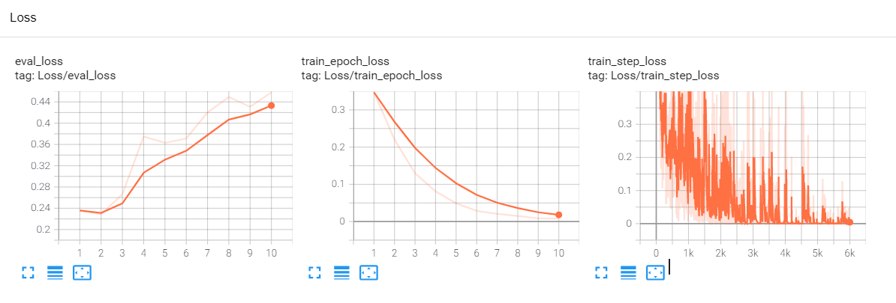

# PyTorch RoFormer
原版Tensorflow权重(https://github.com/ZhuiyiTechnology/roformer)
- [chinese_roformer_L-12_H-768_A-12.zip](https://pan.baidu.com/s/1fiss862YsGCwf2HvU_Jm-g) (提取码：xy9x)
- [chinese_roformer_L-6_H-384_A-6.zip](https://pan.baidu.com/s/1iIXgZHHCgrYGXVRRSSCVPg) (提取码：gy97)
- [chinese_roformer-char_L-12_H-768_A-12.zip](https://pan.baidu.com/s/1Q1pq8F4Fsl6bTipUAkqeDQ) (提取码：bt94)
- [chinese_roformer-char_L-6_H-384_A-6.zip](https://pan.baidu.com/s/1cc281-M0Rsjlwws5phqzbQ)(提取码：a44c)
- [chinese_roformer-sim-char_L-12_H-768_A-12.zip](https://pan.baidu.com/s/1f1FB288nv1a6jYjsNCordg)(提取码：2cgz)
- [chinese_roformer-sim-char_L-6_H-384_A-6.zip](https://pan.baidu.com/s/1r0eJ7shGwQ0RzV9BTFFW4g)(提取码：h68q)

已经转化为PyTorch权重
- [chinese_roformer_small.zip](https://pan.baidu.com/s/1Cx7lhtojTyRF61IKHWXEHw) (提取码：8znw)
- [chinese_roformer_base.zip](https://pan.baidu.com/s/10W5BYDQSeLyajTWjexZeoQ) (提取码：bimr)
- [chinese_roformer_char_base.zip](https://pan.baidu.com/s/18bgJ1t_1ke0BXq_Xg02qSQ) (提取码：oqb5)

## 安装(代码已经加入到huggingface仓库)
transformers v4.7版本已经发布，可以直接安装使用
```bash
pip install -U transformers
```
## 模型权重对照表

### 中文模型
| huggingface.co                     | bert4keras                                       |
| ---------------------------------- | ------------------------------------------------ |
| [roformer_chinese_base](https://huggingface.co/junnyu/roformer_chinese_base)              | [chinese_roformer_L-12_H-768_A-12.zip](https://pan.baidu.com/s/1fiss862YsGCwf2HvU_Jm-g) (download code：xy9x)             |
| [roformer_chinese_small](https://huggingface.co/junnyu/roformer_chinese_small)             | [chinese_roformer_L-6_H-384_A-6.zip](https://pan.baidu.com/s/1iIXgZHHCgrYGXVRRSSCVPg) (download code：gy97)               |
| [roformer_chinese_char_base](https://huggingface.co/junnyu/roformer_chinese_char_base)         | [chinese_roformer-char_L-12_H-768_A-12.zip](https://pan.baidu.com/s/1Q1pq8F4Fsl6bTipUAkqeDQ) (download code：bt94)        |
| [roformer_chinese_char_small](https://huggingface.co/junnyu/roformer_chinese_char_small)        | [chinese_roformer-char_L-6_H-384_A-6.zip](https://pan.baidu.com/s/1cc281-M0Rsjlwws5phqzbQ) (download code：a44c)          |
| [roformer_chinese_sim_char_base](https://huggingface.co/junnyu/roformer_chinese_sim_char_base)     | [chinese_roformer-sim-char_L-12_H-768_A-12.zip](https://pan.baidu.com/s/1f1FB288nv1a6jYjsNCordg) (download code：2cgz)    |
| [roformer_chinese_sim_char_small](https://huggingface.co/junnyu/roformer_chinese_sim_char_small)    | [chinese_roformer-sim-char_L-6_H-384_A-6.zip](https://pan.baidu.com/s/1r0eJ7shGwQ0RzV9BTFFW4g) (download code：h68q)      |
| [roformer_chinese_sim_char_ft_base](https://huggingface.co/junnyu/roformer_chinese_sim_char_ft_base)  | [chinese_roformer-sim-char-ft_L-12_H-768_A-12.zip](https://pan.baidu.com/s/1Igh3tSvSu_ahDZmGaOlVoA) (download code：w15n) |
| [roformer_chinese_sim_char_ft_small](https://huggingface.co/junnyu/roformer_chinese_sim_char_ft_small) | [chinese_roformer-sim-char-ft_L-6_H-384_A-6.zip](https://pan.baidu.com/s/1G36x7YQF1b6nzW0OzyJS_Q) (download code：gty5)   |


### 英文模型（使用electra的训练方法在openwebtext上训练的small模型（rotary value = True）） 
| huggingface.co                     |
| ---------------------------------- |
|[roformer_small_generator](https://huggingface.co/junnyu/roformer_small_generator)|
|[roformer_small_discriminator](https://huggingface.co/junnyu/roformer_small_discriminator)|


## 使用
```python
import torch
from transformers import RoFormerModel, RoFormerTokenizer, TFRoFormerModel
tokenizer = RoFormerTokenizer.from_pretrained("junnyu/roformer_chinese_base")
pt_model = RoFormerModel.from_pretrained("junnyu/roformer_chinese_base")
tf_model = TFRoFormerModel.from_pretrained("junnyu/roformer_chinese_base",
                                           from_pt=True)
text = "这里基本保留了唐宋遗留下来的坊巷格局和大量明清古建筑，其中各级文保单位29处，被誉为“里坊制度的活化石”“明清建筑博物馆”！"
pt_inputs = tokenizer(text, return_tensors="pt")
tf_inputs = tokenizer(text, return_tensors="tf")
with torch.no_grad():
    pt_outputs = pt_model(**pt_inputs).last_hidden_state
print(pt_outputs.shape)
tf_outputs = tf_model(**tf_inputs, training=False).last_hidden_state
print(tf_outputs.shape)
```
## MLM测试
```python
import torch
import tensorflow as tf
from transformers import RoFormerForMaskedLM, RoFormerTokenizer, TFRoFormerForMaskedLM
text = "今天[MASK]很好，我[MASK]去公园玩。"
tokenizer = RoFormerTokenizer.from_pretrained("junnyu/roformer_chinese_base")
pt_model = RoFormerForMaskedLM.from_pretrained("junnyu/roformer_chinese_base")
tf_model = TFRoFormerForMaskedLM.from_pretrained(
    "junnyu/roformer_chinese_base", from_pt=True)
pt_inputs = tokenizer(text, return_tensors="pt")
tf_inputs = tokenizer(text, return_tensors="tf")
# pytorch
with torch.no_grad():
    pt_outputs = pt_model(**pt_inputs).logits[0]
pt_outputs_sentence = "pytorch: "
for i, id in enumerate(tokenizer.encode(text)):
    if id == tokenizer.mask_token_id:
        tokens = tokenizer.convert_ids_to_tokens(pt_outputs[i].topk(k=5)[1])
        pt_outputs_sentence += "[" + "||".join(tokens) + "]"
    else:
        pt_outputs_sentence += "".join(
            tokenizer.convert_ids_to_tokens([id], skip_special_tokens=True))
print(pt_outputs_sentence)
# tf
tf_outputs = tf_model(**tf_inputs, training=False).logits[0]
tf_outputs_sentence = "tf: "
for i, id in enumerate(tokenizer.encode(text)):
    if id == tokenizer.mask_token_id:
        tokens = tokenizer.convert_ids_to_tokens(
            tf.math.top_k(tf_outputs[i], k=5)[1])
        tf_outputs_sentence += "[" + "||".join(tokens) + "]"
    else:
        tf_outputs_sentence += "".join(
            tokenizer.convert_ids_to_tokens([id], skip_special_tokens=True))
print(tf_outputs_sentence)
# pytorch: 今天[天气||天||心情||阳光||空气]很好，我[想||要||打算||准备||喜欢]去公园玩。
# tf:      今天[天气||天||心情||阳光||空气]很好，我[想||要||打算||准备||喜欢]去公园玩。
```
 
## 手动权重转换
```bash
python convert_roformer_original_tf_checkpoint_to_pytorch.py \
    --tf_checkpoint_path=xxxxxx/chinese_roformer_L-12_H-768_A-12/bert_model.ckpt \
    --bert_config_file=pretrained_models/chinese_roformer_base/config.json \
    --pytorch_dump_path=pretrained_models/chinese_roformer_base/pytorch_model.bin
```

## tf与pytorch精度对齐
```python
small版本
bert4keras vs pytorch
mean diff : tensor(5.9108e-07)
max diff : tensor(5.7220e-06)
bert4keras vs tf2.0
mean diff : tensor(4.5976e-07)
max diff : tensor(3.5763e-06)

base版本
python compare_model.py
bert4keras vs pytorch
mean diff : tensor(4.3340e-07)
max diff : tensor(5.7220e-06)
bert4keras vs tf2.0
mean diff : tensor(3.4319e-07)
max diff : tensor(5.2452e-06)
```


## 中文情感分类(chnsenti)
<p align="center">
    
</p>

### 结果

| model | chnsenti  |
| --------------- | --------- |
| tensorflow-NEZHA(base-wwm)      | 94.75     |
| pytorch-NEZHA(base-wwm)         | 94.92     |
| pytorch-RoFormer(base)          | **95.08** |

## 参考
https://github.com/pengming617/bert_classification

https://github.com/bojone/bert4keras

https://github.com/ZhuiyiTechnology/roformer 

https://github.com/lonePatient/NeZha_Chinese_PyTorch 

https://github.com/lonePatient/TorchBlocks

https://github.com/huggingface/transformers

##  Citation

Bibtex:

```tex

@misc{su2021roformer,
      title={RoFormer: Enhanced Transformer with Rotary Position Embedding}, 
      author={Jianlin Su and Yu Lu and Shengfeng Pan and Bo Wen and Yunfeng Liu},
      year={2021},
      eprint={2104.09864},
      archivePrefix={arXiv},
      primaryClass={cs.CL}
}

```
