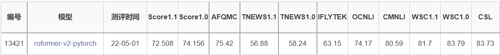

# PyTorch RoFormer & RoFormer-V2
RoFormer模型和RoFormer-V2模型

## 更新
- **2022/05/01**

添加`clue分类任务`的代码和排行榜结果，代码在`examples/clue`文件夹，缺少啥依赖安装啥，比如需要这个`pip install -U accelerate`。
- **2022/04/30** 

有个细节需要注意一下，苏神在微调时无论输入是`text`还是`text pair`类型时，`token_type_id`都置为了0。

如果想要使用与苏神保持一致，那么可以在`tokenizer`时候设置`return_token_type_ids=False`，这样模型会在内部处理。

否则对于`text pair`类型时，会返回与`0，1`两种类型的`token_type_id`
- **2022/04/02**

（1）修改RoFormerForCausalLM，支持`roformer-sim`并提供相关的例子，请见`examples/test_sim.py`。

（2）修改`apply_rotary`实现方式，看起来更简单。
```python
def apply_rotary(x, sinusoidal_pos):
    sin, cos = sinusoidal_pos
    x1, x2 = x[..., 0::2], x[..., 1::2]
    return torch.cat([x1 * cos - x2 * sin, x2 * cos + x1 * sin], dim=-1)
```
- **2022/03/21** 添加`roformer-v2`的权重, 注：必须使用本仓库的代码，不能使用transformers仓库的代码!!!


## 安装

```bash
# v2版本
pip install roformer>=0.4.3
# v1版本(代码已经加入到huggingface仓库，请使用新版本的transformers)
pip install -U transformers
```


## 评测对比

### CLUE-test榜单分类任务结果，base版本。

|         | iflytek | tnews | afqmc | cmnli | ocnli | wsc | csl |
| :-----: | :-----: | :---: | :---: | :---: | :---: | :---: | :---: |
| RoFormerV2<sup>*</sup>-pytorch(本仓库代码) | 63.15 | 58.24 | 75.42 | 80.59 | 74.17 |   83.79   | 83.73 |
| GAU-α-pytorch（Adafactor） | 61.38 | 57.08 | 74.05 | 80.37 | 73.53 | 74.83 | 85.6 |
| GAU-α-pytorch（AdamW wd0.01 warm_decay0.1） | 60.54 | 57.67 | 72.44 | 80.32 | 72.97 | 76.55 | 84.13 |

### Tips:

- 实验环境**RTX 3090**

### leadborad截图
<p align="center">
    
</p>
  

## Roformer-sim测试例子

```python
import torch
import numpy as np
from roformer import RoFormerForCausalLM, RoFormerConfig
from transformers import BertTokenizer

device = torch.device('cuda:0' if torch.cuda.is_available() else 'cpu')
# 可选以下几个。
# junnyu/roformer_chinese_sim_char_small, junnyu/roformer_chinese_sim_char_base
# junnyu/roformer_chinese_sim_char_ft_small, roformer_chinese_sim_char_ft_base
pretrained_model = "junnyu/roformer_chinese_sim_char_base"
tokenizer = BertTokenizer.from_pretrained(pretrained_model)
config = RoFormerConfig.from_pretrained(pretrained_model)
config.is_decoder = True
config.eos_token_id = tokenizer.sep_token_id
config.pooler_activation = "linear"
model = RoFormerForCausalLM.from_pretrained(pretrained_model, config=config)
model.to(device)
model.eval()

def gen_synonyms(text, n=100, k=20):
    ''''含义： 产生sent的n个相似句，然后返回最相似的k个。
    做法：用seq2seq生成，并用encoder算相似度并排序。
    '''
    # 寻找所有相似的句子
    r = []
    inputs1 = tokenizer(text, return_tensors="pt")
    for _ in range(n):
        inputs1.to(device)
        output = tokenizer.batch_decode(model.generate(**inputs1, top_p=0.95, do_sample=True, max_length=128), skip_special_tokens=True)[0].replace(" ","").replace(text, "") # 去除空格，去除原始text文本。
        r.append(output)
    
    # 对相似的句子进行排序
    r = [i for i in set(r) if i != text and len(i) > 0]
    r = [text] + r
    inputs2 = tokenizer(r, padding=True, return_tensors="pt")
    with torch.no_grad():
        inputs2.to(device)
        outputs = model(**inputs2)
        Z = outputs.pooler_output.cpu().numpy()
    Z /= (Z**2).sum(axis=1, keepdims=True)**0.5
    argsort = np.dot(Z[1:], -Z[0]).argsort()
    
    return [r[i + 1] for i in argsort[:k]]

out = gen_synonyms("广州和深圳哪个好？")
print(out)
# ['深圳和广州哪个好？',
#  '广州和深圳哪个好',
#  '深圳和广州哪个好',
#  '深圳和广州哪个比较好。',
#  '深圳和广州哪个最好？',
#  '深圳和广州哪个比较好',
#  '广州和深圳那个比较好',
#  '深圳和广州哪个更好？',
#  '深圳与广州哪个好',
#  '深圳和广州，哪个比较好',
#  '广州与深圳比较哪个好',
#  '深圳和广州哪里比较好',
#  '深圳还是广州比较好？',
#  '广州和深圳哪个地方好一些？',
#  '广州好还是深圳好？',
#  '广州好还是深圳好呢？',
#  '广州与深圳哪个地方好点？',
#  '深圳好还是广州好',
#  '广州好还是深圳好',
#  '广州和深圳哪个城市好？']
```


## 模型权重对照表

### 中文模型 roformer-v2
| huggingface.co                     | bert4keras                                       |
| ---------------------------------- | ------------------------------------------------ |
| [roformer_v2_chinese_char_small](https://huggingface.co/junnyu/roformer_v2_chinese_char_small)              | [chinese_roformer-v2-char_L-6_H-384_A-6.zip](https://pan.baidu.com/s/1huUrC9P60Afggo8AfiUcmA) (download code：ttn4)             |
| [roformer_v2_chinese_char_base](https://huggingface.co/junnyu/roformer_v2_chinese_char_base)              | [chinese_roformer-v2-char_L-12_H-768_A-12.zip](https://pan.baidu.com/s/1qcnN4LVKVe0-mnHlkN3-6Q) (download code：pfoh)               |
| [roformer_v2_chinese_char_large](https://huggingface.co/junnyu/roformer_v2_chinese_char_large)          | [chinese_roformer-v2-char_L-24_H-1024_A-16.zip](https://pan.baidu.com/s/1QiJWSZrGxn8vek-8myvL6w) (download code：npfv)        |


### 中文模型 roformer-v1
| huggingface.co                     | bert4keras                                       |
| ---------------------------------- | ------------------------------------------------ |
| [roformer_chinese_base](https://huggingface.co/junnyu/roformer_chinese_base)              | [chinese_roformer_L-12_H-768_A-12.zip](https://pan.baidu.com/s/1fiss862YsGCwf2HvU_Jm-g) (download code：xy9x)             |
| [roformer_chinese_small](https://huggingface.co/junnyu/roformer_chinese_small)             | [chinese_roformer_L-6_H-384_A-6.zip](https://pan.baidu.com/s/1iIXgZHHCgrYGXVRRSSCVPg) (download code：gy97)               |
| [roformer_chinese_char_base](https://huggingface.co/junnyu/roformer_chinese_char_base)         | [chinese_roformer-char_L-12_H-768_A-12.zip](https://pan.baidu.com/s/1Q1pq8F4Fsl6bTipUAkqeDQ) (download code：bt94)        |
| [roformer_chinese_char_small](https://huggingface.co/junnyu/roformer_chinese_char_small)        | [chinese_roformer-char_L-6_H-384_A-6.zip](https://pan.baidu.com/s/1cc281-M0Rsjlwws5phqzbQ) (download code：a44c)          |
| [roformer_chinese_sim_char_base](https://huggingface.co/junnyu/roformer_chinese_sim_char_base)     | [chinese_roformer-sim-char_L-12_H-768_A-12.zip](https://pan.baidu.com/s/1f1FB288nv1a6jYjsNCordg) (download code：2cgz)    |
| [roformer_chinese_sim_char_small](https://huggingface.co/junnyu/roformer_chinese_sim_char_small)    | [chinese_roformer-sim-char_L-6_H-384_A-6.zip](https://pan.baidu.com/s/1r0eJ7shGwQ0RzV9BTFFW4g) (download code：h68q)      |
| [roformer_chinese_sim_char_ft_base](https://huggingface.co/junnyu/roformer_chinese_sim_char_ft_base)  | [chinese_roformer-sim-char-ft_L-12_H-768_A-12.zip](https://pan.baidu.com/s/1Igh3tSvSu_ahDZmGaOlVoA) (download code：w15n) |
| [roformer_chinese_sim_char_ft_small](https://huggingface.co/junnyu/roformer_chinese_sim_char_ft_small) | [chinese_roformer-sim-char-ft_L-6_H-384_A-6.zip](https://pan.baidu.com/s/1G36x7YQF1b6nzW0OzyJS_Q) (download code：gty5)   |


### 英文模型（使用electra的训练方法在openwebtext上训练的small模型（rotary value = True）） 
| huggingface.co                     |
| ---------------------------------- |
|[roformer_small_generator](https://huggingface.co/junnyu/roformer_small_generator)|
|[roformer_small_discriminator](https://huggingface.co/junnyu/roformer_small_discriminator)|


## Roformer-v2 MLM测试

```python
import torch
import tensorflow as tf
from transformers import BertTokenizer
from roformer import RoFormerForMaskedLM, TFRoFormerForMaskedLM

text = "今天[MASK]很好，我[MASK]去公园玩。"
tokenizer = BertTokenizer.from_pretrained("junnyu/roformer_v2_chinese_char_base")
pt_model = RoFormerForMaskedLM.from_pretrained("junnyu/roformer_v2_chinese_char_base")
tf_model = TFRoFormerForMaskedLM.from_pretrained(
    "junnyu/roformer_v2_chinese_char_base", from_pt=True
)
pt_inputs = tokenizer(text, return_tensors="pt")
tf_inputs = tokenizer(text, return_tensors="tf")
# pytorch
with torch.no_grad():
    pt_outputs = pt_model(**pt_inputs).logits[0]
pt_outputs_sentence = "pytorch: "
for i, id in enumerate(tokenizer.encode(text)):
    if id == tokenizer.mask_token_id:
        tokens = tokenizer.convert_ids_to_tokens(pt_outputs[i].topk(k=5)[1])
        pt_outputs_sentence += "[" + "||".join(tokens) + "]"
    else:
        pt_outputs_sentence += "".join(
            tokenizer.convert_ids_to_tokens([id], skip_special_tokens=True)
        )
print(pt_outputs_sentence)
# tf
tf_outputs = tf_model(**tf_inputs, training=False).logits[0]
tf_outputs_sentence = "tf: "
for i, id in enumerate(tokenizer.encode(text)):
    if id == tokenizer.mask_token_id:
        tokens = tokenizer.convert_ids_to_tokens(tf.math.top_k(tf_outputs[i], k=5)[1])
        tf_outputs_sentence += "[" + "||".join(tokens) + "]"
    else:
        tf_outputs_sentence += "".join(
            tokenizer.convert_ids_to_tokens([id], skip_special_tokens=True)
        )
print(tf_outputs_sentence)
# small
# pytorch: 今天[的||，||是||很||也]很好，我[要||会||是||想||在]去公园玩。
# tf: 今天[的||，||是||很||也]很好，我[要||会||是||想||在]去公园玩。
# base
# pytorch: 今天[我||天||晴||园||玩]很好，我[想||要||会||就||带]去公园玩。
# tf: 今天[我||天||晴||园||玩]很好，我[想||要||会||就||带]去公园玩。
# large
# pytorch: 今天[天||气||我||空||阳]很好，我[又||想||会||就||爱]去公园玩。
# tf: 今天[天||气||我||空||阳]很好，我[又||想||会||就||爱]去公园玩。
```


## Roformer-v1 MLM测试

```python
import torch
import tensorflow as tf
from transformers import RoFormerForMaskedLM, RoFormerTokenizer, TFRoFormerForMaskedLM

text = "今天[MASK]很好，我[MASK]去公园玩。"
tokenizer = RoFormerTokenizer.from_pretrained("junnyu/roformer_chinese_base")
pt_model = RoFormerForMaskedLM.from_pretrained("junnyu/roformer_chinese_base")
tf_model = TFRoFormerForMaskedLM.from_pretrained(
    "junnyu/roformer_chinese_base", from_pt=True
)
pt_inputs = tokenizer(text, return_tensors="pt")
tf_inputs = tokenizer(text, return_tensors="tf")
# pytorch
with torch.no_grad():
    pt_outputs = pt_model(**pt_inputs).logits[0]
pt_outputs_sentence = "pytorch: "
for i, id in enumerate(tokenizer.encode(text)):
    if id == tokenizer.mask_token_id:
        tokens = tokenizer.convert_ids_to_tokens(pt_outputs[i].topk(k=5)[1])
        pt_outputs_sentence += "[" + "||".join(tokens) + "]"
    else:
        pt_outputs_sentence += "".join(
            tokenizer.convert_ids_to_tokens([id], skip_special_tokens=True)
        )
print(pt_outputs_sentence)
# tf
tf_outputs = tf_model(**tf_inputs, training=False).logits[0]
tf_outputs_sentence = "tf: "
for i, id in enumerate(tokenizer.encode(text)):
    if id == tokenizer.mask_token_id:
        tokens = tokenizer.convert_ids_to_tokens(tf.math.top_k(tf_outputs[i], k=5)[1])
        tf_outputs_sentence += "[" + "||".join(tokens) + "]"
    else:
        tf_outputs_sentence += "".join(
            tokenizer.convert_ids_to_tokens([id], skip_special_tokens=True)
        )
print(tf_outputs_sentence)
# pytorch: 今天[天气||天||心情||阳光||空气]很好，我[想||要||打算||准备||喜欢]去公园玩。
# tf:      今天[天气||天||心情||阳光||空气]很好，我[想||要||打算||准备||喜欢]去公园玩。

```


## 手动权重转换

```bash
python convert_roformer_original_tf_checkpoint_to_pytorch.py \
    --tf_checkpoint_path=xxxxxx/chinese_roformer_L-12_H-768_A-12/bert_model.ckpt \
    --bert_config_file=pretrained_models/chinese_roformer_base/config.json \
    --pytorch_dump_path=pretrained_models/chinese_roformer_base/pytorch_model.bin
```


## tf与pytorch精度对齐

```python
small版本
bert4keras vs pytorch
mean diff : tensor(5.9108e-07)
max diff : tensor(5.7220e-06)
bert4keras vs tf2.0
mean diff : tensor(4.5976e-07)
max diff : tensor(3.5763e-06)

base版本
python compare_model.py
bert4keras vs pytorch
mean diff : tensor(4.3340e-07)
max diff : tensor(5.7220e-06)
bert4keras vs tf2.0
mean diff : tensor(3.4319e-07)
max diff : tensor(5.2452e-06)
```


## 参考

https://github.com/pengming617/bert_classification

https://github.com/bojone/bert4keras

https://github.com/ZhuiyiTechnology/roformer 

https://github.com/lonePatient/NeZha_Chinese_PyTorch 

https://github.com/lonePatient/TorchBlocks

https://github.com/huggingface/transformers


##  Citation

Bibtex:

```tex

@misc{su2021roformer,
      title={RoFormer: Enhanced Transformer with Rotary Position Embedding}, 
      author={Jianlin Su and Yu Lu and Shengfeng Pan and Bo Wen and Yunfeng Liu},
      year={2021},
      eprint={2104.09864},
      archivePrefix={arXiv},
      primaryClass={cs.CL}
}

```

```tex
@techreport{roformerv2,
  title={RoFormerV2: A Faster and Better RoFormer - ZhuiyiAI},
  author={Jianlin Su, Shengfeng Pan, Bo Wen, Yunfeng Liu},
  year={2022},
  url="https://github.com/ZhuiyiTechnology/roformer-v2",
}
```
