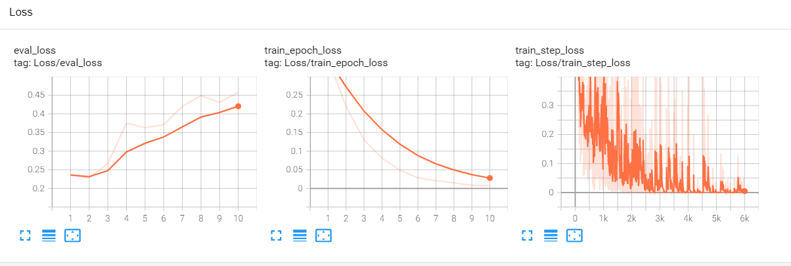

# huggingface pytorch roformer

## 权重转换
```bash
python convert_roformer_original_tf_checkpoint_to_pytorch.py \
    --tf_checkpoint_path=xxxxxx/chinese_roformer_L-12_H-768_A-12/bert_model.ckpt \
    --roformer_config_file=pretrained_models/chinese_roformer_base/config.json \
    --pytorch_dump_path=pretrained_models/chinese_roformer_base/pytorch_model.bin
```
## tf与pytorch精度对齐
```python
python compare.py
mean difference : tensor(4.3925e-07)
max  difference : tensor(7.6294e-06)
```

## 中文情感分类(chnsenti)
```bash
bash run.sh
```
<p align="center">
    
</p>

### 结果

| model | chnsenti  |
| --------------- | --------- |
| tensorflow-NEZHA(base-wwm)      | 94.75     |
| pytorch-NEZHA(base-wwm)         | 94.92     |
| pytorch-ReFormer(base)          | **95.08** |

## 参考
https://github.com/pengming617/bert_classification

https://github.com/bojone/bert4keras

https://github.com/ZhuiyiTechnology/roformer 

https://github.com/lonePatient/NeZha_Chinese_PyTorch 

https://github.com/lonePatient/TorchBlocks
